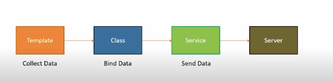
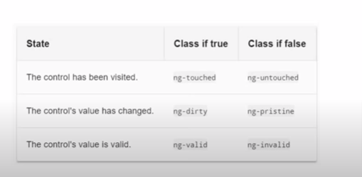
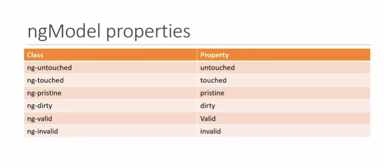

# Angular Forms

Vital to business Applications

Create an experience that guide the user efficiently and effectively through the workflow.

Developers:
- Data Binding
- Change Tracking
- Validation
- Visual Feedback
- Error Message
- Form Submission

Two Approches: 

- Template Driven Forms
  - Heavy on the component template  
    - Most of the code in written in component template
- Reactive Forms or Model Driven Forms
  - Heavy on the component class
    - Most of the code in written in component class

---

# Template Driven Forms (TDF)

* Easy to use and similar to Angular Js Forms.
* Two way data binding with ngModel
* Buklky HTML and minimal component code.
* Automatically tracks the form and form elements state and validity.

## Drawbacks; 

* Unit testing is a challenge
* Readability decreases with complex forms and validations.

## Flow to Study:

* Generate a new CLI project 
* Add the form HTML
* Binding data
* Tracking state and validity
* Providing visual feedback
* Displaying error messages

---

## Track Control, State and Validity

